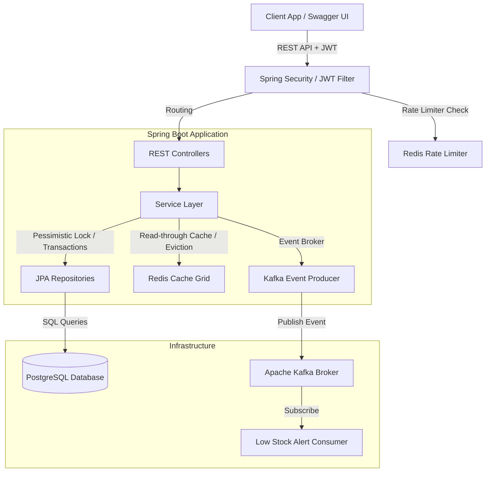
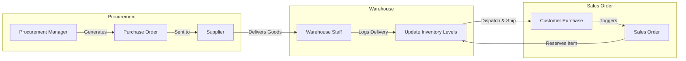
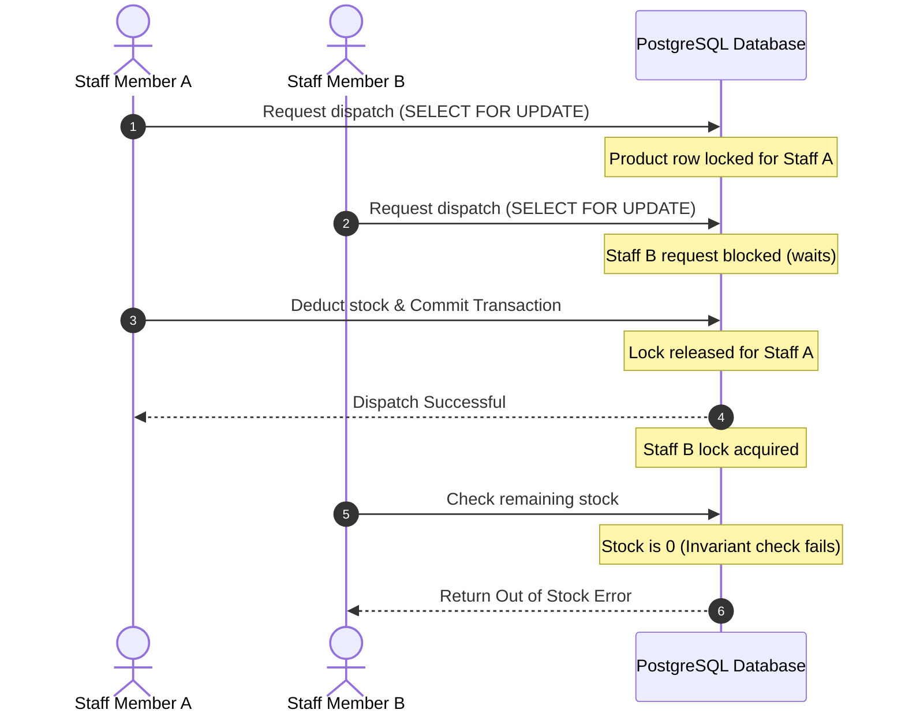
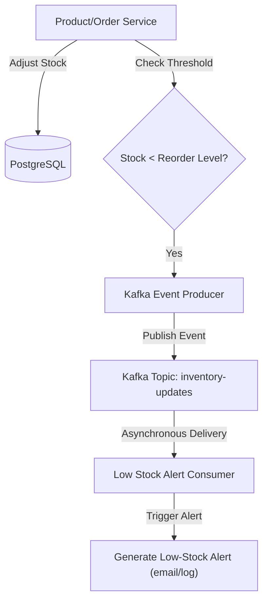

# SupplySync — Warehouse & Inventory Management Platform

SupplySync is a production-grade backend inventory and order management platform built for logistics and warehouse tracking. It features concurrent stock allocation, dynamic product searching, Redis caching/rate-limiting, event-driven integrations via Kafka, and strict role-based access control.

---

## Architecture Overview

SupplySync employs a layered Spring Boot architecture integrating relational persistence, memory-grid caching, and event stream broadcasting.



### Core Architecture Components
1. **Spring Security & Authentication (JWT)**: Secures all endpoints. Bearer tokens are validated on each request. Logged-out tokens are blacklisted in Redis.
2. **Pessimistic Write Locking**: Prevents race conditions during stock transfers and sales order bookings by locking specific warehouse-product stock rows.
3. **Redis Cache Grid**:
   - Cache Names: `inventory:low-stock`, `reportsDashboard`
   - Cache Eviction: Occurs automatically during inventory adjustments, transfers, and order processing to keep data consistent.
   - Redis Rate Limiter: Protects login attempts against brute force by blocking IPs for 15 minutes after multiple failed attempts.
4. **Apache Kafka Event Streaming**: Broadcasts state changes asynchronously (e.g., `SalesOrderCreatedEvent`, `SalesOrderCancelledEvent`, `InventoryUpdatedEvent`).

---

## Technical Process Workflows & Flowcharts

The following Mermaid diagrams outline the key business workflows and technical processes of SupplySync (ideal for visual aids during system presentations).

### 1. Business Value Lifecycle Flow



### 3. Concurrency Control (Pessimistic Write Locking)



### 4. Asynchronous Event-Driven Alerts (Apache Kafka)



---

## Core Technologies
- **Backend Framework**: Spring Boot 3.3.4 (Java 21)
- **Database Layer**: PostgreSQL + Spring Data JPA
- **Database Migrations**: Flyway
- **Caching & Rate Limiting**: Redis (StringRedisTemplate / CacheManager)
- **Event Streaming**: Apache Kafka (KafkaTemplate)
- **API Documentation**: OpenAPI 3 + Swagger UI
- **Testing**: JUnit 5 + Mockito + In-Memory H2

---

## Getting Started

### 1. Prerequisites
Ensure you have the following installed:
- **Java 21** (or Java 17)
- **Maven 3.x**
- **Docker & Docker Compose**

### 2. Start Infrastructure Services
Spin up PostgreSQL, Redis, and Kafka in the background:
```bash
docker-compose up -d
```

### 3. Run the Application
Start the Spring Boot server locally:
```bash
./mvnw spring-boot:run
```
By default, the server listens on port `8080`.

### 4. Interactive API Documentation
Access Swagger UI to interact with the endpoints:
- **Swagger UI:** [http://localhost:8080/swagger-ui.html](http://localhost:8080/swagger-ui.html)
- **OpenAPI Definition (JSON):** [http://localhost:8080/v3/api-docs](http://localhost:8080/v3/api-docs)

### 5. Run Automated Tests
Run integration and unit tests:
```bash
./mvnw test
```

---

## Security & User Roles

All endpoints (excluding Auth endpoints) require a `Bearer <JWT_ACCESS_TOKEN>` in the `Authorization` header.

Available roles:
- `ADMIN`: Complete system access including warehouse creations and soft-deletes.
- `WAREHOUSE_MANAGER`: Handles categories, products, stock adjustments, and transfers.
- `PROCUREMENT_MANAGER`: Manages suppliers and purchase orders.
- `STAFF`: Performs day-to-day warehouse duties, records adjustments/transfers, and processes sales orders.

---

## Complete API Endpoints

### 1. Authentication (`/api/v1/auth`)

#### `POST /api/v1/auth/register`
* **Access**: Public
* **Request Body (`RegisterRequest`)**:
  ```json
  {
    "username": "warehouse_mgr_bob",
    "email": "bob@supplysync.com",
    "password": "SecurePassword123",
    "role": "WAREHOUSE_MANAGER"
  }
  ```
* **Response Body (`RegisterResponse`)** - Status `201 Created`:
  ```json
  {
    "id": 1,
    "username": "warehouse_mgr_bob",
    "email": "bob@supplysync.com",
    "role": "WAREHOUSE_MANAGER",
    "accessToken": "eyJhbGciOi...",
    "refreshToken": "48b6289b..."
  }
  ```

#### `POST /api/v1/auth/login`
* **Access**: Public (Rate-limited via Redis)
* **Request Body (`LoginRequest`)**:
  ```json
  {
    "username": "warehouse_mgr_bob",
    "password": "SecurePassword123"
  }
  ```
* **Response Body (`LoginResponse`)** - Status `200 OK`:
  ```json
  {
    "username": "warehouse_mgr_bob",
    "role": "WAREHOUSE_MANAGER",
    "accessToken": "eyJhbGciOi...",
    "refreshToken": "48b6289b..."
  }
  ```

#### `POST /api/v1/auth/refresh`
* **Access**: Public
* **Request Body (`TokenRefreshRequest`)**:
  ```json
  {
    "refreshToken": "48b6289b-871d-4eb2-a16f-631d8ce0a9f5"
  }
  ```
* **Response Body (`TokenRefreshResponse`)** - Status `200 OK`:
  ```json
  {
    "accessToken": "eyJhbGciOi...",
    "refreshToken": "48b6289b..."
  }
  ```

#### `POST /api/v1/auth/logout`
* **Access**: Authenticated
* **Headers**: `Authorization: Bearer <token>`
* **Response**: Status `200 OK` (token blacklisted in Redis).

---

### 2. Warehouse Management (`/api/v1/warehouses`)

#### `POST /api/v1/warehouses`
* **Access**: `ADMIN`
* **Request Body (`WarehouseRequest`)**:
  ```json
  {
    "name": "Midwest Distribution Hub",
    "warehouseCode": "WH-MIDWEST-01",
    "address": "404 Logistics Boulevard",
    "city": "Chicago",
    "state": "IL",
    "postalCode": "60666",
    "country": "USA"
  }
  ```
* **Response Body (`WarehouseResponse`)** - Status `201 Created`:
  ```json
  {
    "id": 1,
    "name": "Midwest Distribution Hub",
    "warehouseCode": "WH-MIDWEST-01",
    "address": "404 Logistics Boulevard",
    "city": "Chicago",
    "state": "IL",
    "postalCode": "60666",
    "country": "USA",
    "isActive": true
  }
  ```

#### `GET /api/v1/warehouses`
* **Access**: Authenticated
* **Query Parameters**:
  - `page` (int, default: `0`)
  - `size` (int, default: `10`)
  - `city` (string, optional)
  - `state` (string, optional)
* **Response Body**: Paginated JSON object listing `WarehouseResponse`.

#### `GET /api/v1/warehouses/{id}`
* **Access**: Authenticated
* **Response Body (`WarehouseDetailResponse`)** - Status `200 OK`:
  ```json
  {
    "id": 1,
    "name": "Midwest Distribution Hub",
    "warehouseCode": "WH-MIDWEST-01",
    "address": "404 Logistics Boulevard",
    "city": "Chicago",
    "state": "IL",
    "postalCode": "60666",
    "country": "USA",
    "isActive": true,
    "totalProductsStored": 142,
    "totalQuantity": 24050
  }
  ```

---

### 3. Category Management (`/api/v1/categories`)

#### `POST /api/v1/categories`
* **Access**: `ADMIN`, `WAREHOUSE_MANAGER`
* **Request Body (`CategoryRequest`)**:
  ```json
  {
    "name": "Laptops",
    "categoryCode": "CAT-LAPTOP-01",
    "parentCategoryId": 2
  }
  ```
* **Response Body (`CategoryResponse`)** - Status `201 Created`:
  ```json
  {
    "id": 5,
    "name": "Laptops",
    "categoryCode": "CAT-LAPTOP-01",
    "parentCategoryId": 2,
    "parentCategoryName": "Electronics"
  }
  ```

#### `GET /api/v1/categories/tree`
* **Access**: Authenticated
* **Response Body (`List<CategoryTreeResponse>`)** - Status `200 OK`:
  ```json
  [
    {
      "id": 2,
      "name": "Electronics",
      "categoryCode": "CAT-ELEC",
      "children": [
        {
          "id": 5,
          "name": "Laptops",
          "categoryCode": "CAT-LAPTOP-01",
          "children": []
        }
      ]
    }
  ]
  ```

---

### 4. Product Management (`/api/v1/products`)

#### `POST /api/v1/products`
* **Access**: `ADMIN`, `WAREHOUSE_MANAGER`
* **Request Body (`ProductRequest`)**:
  ```json
  {
    "name": "Ultra-Wide Monitor 34\"",
    "sku": "MON-UW-34",
    "description": "34-inch QHD curved workstation monitor",
    "price": "499.99",
    "cost": "280.00",
    "categoryId": 2,
    "reorderLevel": 15
  }
  ```
* **Response Body (`ProductResponse`)** - Status `201 Created`:
  ```json
  {
    "id": 12,
    "name": "Ultra-Wide Monitor 34\"",
    "sku": "MON-UW-34",
    "description": "34-inch QHD curved workstation monitor",
    "price": 499.99,
    "cost": 280.00,
    "categoryId": 2,
    "categoryName": "Electronics",
    "reorderLevel": 15,
    "isActive": true
  }
  ```

#### `GET /api/v1/products/{id}`
* **Access**: Authenticated
* **Response Body (`ProductDetailResponse`)** - Status `200 OK`:
  ```json
  {
    "id": 12,
    "name": "Ultra-Wide Monitor 34\"",
    "sku": "MON-UW-34",
    "description": "34-inch QHD curved workstation monitor",
    "price": 499.99,
    "cost": 280.00,
    "categoryId": 2,
    "categoryName": "Electronics",
    "reorderLevel": 15,
    "isActive": true,
    "inventoryByWarehouse": [
      {
        "warehouseId": 1,
        "warehouseName": "Midwest Distribution Hub",
        "quantityAvailable": 45,
        "quantityReserved": 5
      }
    ]
  }
  ```

---

### 5. Inventory Management (`/api/v1/inventory`)

#### `POST /api/v1/inventory/adjust`
* **Access**: `WAREHOUSE_MANAGER`, `STAFF`
* **Request Body (`InventoryAdjustRequest`)**:
  ```json
  {
    "productId": 12,
    "warehouseId": 1,
    "quantity": 5,
    "transactionType": "DAMAGE",
    "notes": "Monitor screen cracked during forklift transit"
  }
  ```
* **Response Body (`InventoryTransactionResponse`)** - Status `200 OK`:
  ```json
  {
    "id": 89,
    "productId": 12,
    "productName": "Ultra-Wide Monitor 34\"",
    "warehouseId": 1,
    "warehouseName": "Midwest Distribution Hub",
    "transactionType": "DAMAGE",
    "quantity": 5,
    "referenceId": "ADJUST-1780729960",
    "performedByUserId": 3,
    "performedByUsername": "bob_staff",
    "notes": "Monitor screen cracked during forklift transit",
    "timestamp": "2026-06-06T12:50:00"
  }
  ```

#### `POST /api/v1/inventory/transfer`
* **Access**: `WAREHOUSE_MANAGER`, `STAFF`
* **Request Body (`InventoryTransferRequest`)**:
  ```json
  {
    "productId": 12,
    "sourceWarehouseId": 1,
    "destinationWarehouseId": 2,
    "quantity": 10
  }
  ```
* **Response Body (`InventoryTransferResponse`)** - Status `200 OK`:
  ```json
  {
    "productId": 12,
    "sourceWarehouseId": 1,
    "destinationWarehouseId": 2,
    "quantity": 10,
    "transferTimestamp": "2026-06-06T12:51:30"
  }
  ```

#### `GET /api/v1/inventory/low-stock`
* **Access**: `ADMIN`, `WAREHOUSE_MANAGER`, `STAFF` (Caches in Redis under `inventory:low-stock`)
* **Response Body (`List<LowStockAlertResponse>`)** - Status `200 OK`:
  ```json
  [
    {
      "productId": 12,
      "productName": "Ultra-Wide Monitor 34\"",
      "sku": "MON-UW-34",
      "warehouseId": 1,
      "warehouseName": "Midwest Distribution Hub",
      "quantityAvailable": 12,
      "reorderLevel": 15
    }
  ]
  ```

---

### 6. Purchase Order Management (`/api/v1/purchase-orders`)

#### `POST /api/v1/purchase-orders`
* **Access**: `PROCUREMENT_MANAGER`
* **Request Body (`PurchaseOrderRequest`)**:
  ```json
  {
    "supplierId": 4,
    "warehouseId": 1,
    "items": [
      {
        "productId": 12,
        "quantity": 100,
        "unitPrice": "260.00"
      }
    ]
  }
  ```
* **Response Body (`PurchaseOrderResponse`)** - Status `201 Created`:
  ```json
  {
    "id": 8,
    "poNumber": "PO-1780730005",
    "supplierId": 4,
    "supplierName": "Global Tech Displays Inc",
    "warehouseId": 1,
    "warehouseName": "Midwest Distribution Hub",
    "status": "DRAFT",
    "totalAmount": 26000.00,
    "items": [
      {
        "id": 15,
        "productId": 12,
        "productName": "Ultra-Wide Monitor 34\"",
        "quantityOrdered": 100,
        "quantityReceived": 0,
        "unitPrice": 260.00
      }
    ]
  }
  ```

---

### 7. Sales Order Management (`/api/v1/sales-orders`)

#### `POST /api/v1/sales-orders`
* **Access**: `STAFF`, `WAREHOUSE_MANAGER`
* **Request Body (`SalesOrderRequest`)**:
  ```json
  {
    "warehouseId": 1,
    "customerName": "Acme Retailers",
    "customerEmail": "billing@acme.com",
    "customerPhone": "+1-555-123-4567",
    "shippingAddress": "123 ACME Way, Suite 100",
    "items": [
      {
        "productId": 12,
        "quantity": 10
      }
    ]
  }
  ```
* **Response Body (`SalesOrderResponse`)** - Status `201 Created`:
  ```json
  {
    "id": 22,
    "orderNumber": "SO-1780730412",
    "warehouseId": 1,
    "warehouseName": "Midwest Distribution Hub",
    "customerName": "Acme Retailers",
    "status": "CONFIRMED",
    "totalAmount": 4999.90,
    "items": [
      {
        "id": 40,
        "productId": 12,
        "productName": "Ultra-Wide Monitor 34\"",
        "quantity": 10,
        "unitPrice": 499.99
      }
    ]
  }
  ```

---

### 8. Reporting & Analytics (`/api/v1/reports`)

#### `GET /api/v1/reports/dashboard`
* **Access**: `ADMIN`, `WAREHOUSE_MANAGER`, `PROCUREMENT_MANAGER` (Caches in Redis under `reportsDashboard` for 10 min)
* **Response Body (`DashboardResponse`)** - Status `200 OK`.
